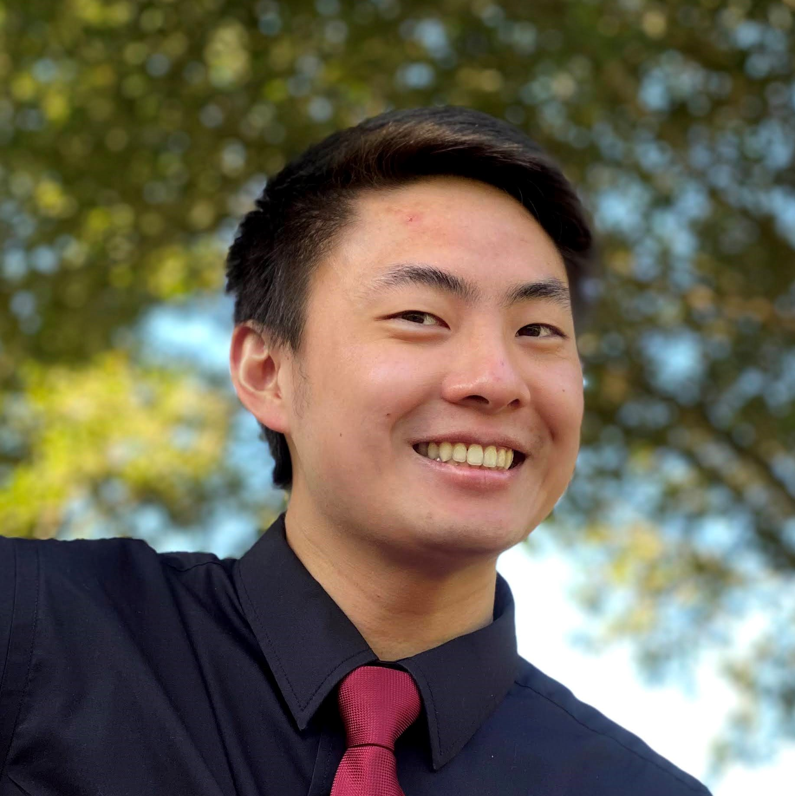

# Elias Fang's User Page

## Navigation

[Who Am I?](#who-am-i)

[Profile Picture](#profile-picture)

[Coding Stuff](#coding-stuff)

[Favorite Quotes](#favorite-quotes)

[Markdown Features](#markdown-features)

[README](README.md)

## Who Am I?

My name is Elias Fang and I am a second-year Computer Engineering student in Warren College at UC San Diego. I love to eat good food, play video games, and build new productive habits. I'm currently living at home in Irvine, California and taking CSE 110 remotely.

Some UCSD orgs that I am a part of:

1. Kairos Christian Fellowship 
2. Association for Computer Machinery at UCSD
3. Triton Software Engineering
4. Triton Engineering Student Council
5. Duly Noted Acapella

Go Tritons! 🔱

## Profile Picture

This is a photo of me!



## Coding Stuff

### Experience

#### Chick-fil-A

This summer, I will be a Digital Transformation and Technology Software Engineering Intern with **Chick-fil-A**!

#### Tala Security

Last summer, I interned with **Tala Security** and developed a Google Chrome extension that could detect various web and fingerprint trackers.

### Projects

Take a look at a few of my projects! 💻

- [My Memory](https://github.com/eliasfang/MyMemory): A Kotlin-based Android memory game.
- [Instagram Clone](https://github.com/eliasfang/InstagramClone): A clone of the popular social media app, Instagram, for Android.
- [gimme-a-break](https://github.com/eliasfang/gimme-a-break): A web application based on Pomodoro timers that focuses on well-being and productivity.
- [SD Hacks 2021](https://www.sdhacks.io/): The main website for SD Hacks 2021, an annual hackathon hosted at UCSD.

### Back to Basics

These are the very first lines of code I ever wrote 🙀:

```
#include <stdio.h>
int main() {
   printf("Hello, World!");
   return 0;
}
```

## Favorite Quotes

Wise words from wise people 🦉

> Leadership: The skill of influencing people to work enthusiastically toward goals identified as being for the common good.

~ James Hunter, *The Servant*

> Therefore, as we have opportunity, let us do good to all people, especially to those who belong to the family of believers.

~ Paul, *Galatians 6:10*

> People who love each other fully and truly are the happiest people in the world. They may have little, they may have nothing, but they are happy people. Everything depends on how we love one another.

~ Mother Teresa

## Markdown Features

Here are the Markdown features that I've included in this User Page:

- [X] Pictures
- [X] Links
- [X] Headings
- [X] Styled text
- [X] Quoted text
- [X] Quoted code
- [X] Section links
- [X] Relative links
- [X] Lists
- [X] Task lists